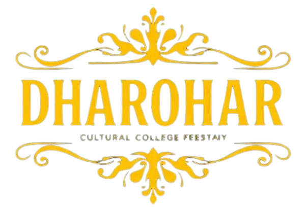

# 🎭 Dharohar — Annual Cultural Fest Website

<div align="center">



### **धरोहर 2024 • Edition XVII**
*Unite ✦ Celebrate ✦ Create*

[](https://reactjs.org/)
[](https://vitejs.dev/)
[](https://tailwindcss.com/)
[](https://lucide.dev/)
[](#-license)

**The official modern web portal for Dharohar — the flagship annual cultural fest of ABES Engineering College, Ghaziabad.**

[Key Features](#-key-features) • [Tech Stack](#-tech-stack) • [Getting Started](#-getting-started) • [Project Structure](#-project-structure) • [Festival Highlights](#-festival-highlights) • [Contributors](#-contributors)

</div>

---

## 🌟 Overview

**Dharohar (धरोहर)** is an electrifying three-day cultural extravaganza hosted annually at **ABES Engineering College**. Celebrating timeless Indian heritage fused with modern youth creativity, it unites **15,000+ attendees** and participants from over **50+ colleges across India**.

This web platform serves as an interactive hub for festival-goers, participants, and sponsors to discover event lineups, explore photo galleries, book festival passes, and connect with organizers.

---

## ✨ Key Features

- 🌌 **Interactive Physics Particles Canvas**: Custom particle background with light grains and responsive cursor repulsion physics.
- 🎨 **Regal Cultural Aesthetics**: Golden typography, rich Indian motifs, deep obsidian & purple palettes, and backdrop blur effects.
- 🧭 **Glassmorphic Navigation Bar**: Responsive sticky header with ScrollSpy navigation, smooth scrolling, and mobile dropdown drawer.
- 📅 **Interactive 3-Day Schedule Explorer**: Multi-day filterable timeline covering Day 1 (*Aarambh*), Day 2 (*Utsav*), and Day 3 (*Star Night Dhamaka*).
- 🎟️ **Pass & Ticket Booking Showcase**: Clean tier breakdown for Student General Passes, All-Access Festival Passes, and VIP Golden Lounge Passes.
- 🖼️ **Dynamic Picture Gallery**: Curated photo grid capturing dance competitions, rock battles, thespian acts, and carnival attractions.
- 🤝 **Sponsor Showcase**: Brand partner visibility featuring BoAt, Spotify, Coca-Cola, Zomato, Paytm, and Hostinger.
- 📇 **Interactive Coordinator Directory**: Contact cards with dynamic cursor-tracking radial gradients, 1-click clipboard copy for emails/phones, and direct mail/call triggers.
- 🪟 **Universal Modal System**: Accessible dialog overlays with keyboard support (`Escape` key navigation) for in-depth information.
- 📱 **Fully Responsive**: Optimized fluid layouts tested across mobile, tablet, and widescreen desktop displays.

---

## 🛠️ Tech Stack

| Category | Technology |
|---|---|
| **Frontend Library** | [React 18](https://react.js.org/) |
| **Build Tool & Bundler** | [Vite 5](https://vitejs.dev/) |
| **Styling & CSS** | [Tailwind CSS 3](https://tailwindcss.com/) with PostCSS & Autoprefixer |
| **Iconography** | [Lucide React](https://lucide.dev/) |
| **Typography** | Cinzel, Montserrat, Rozha One & Google Fonts |
| **Deployment** | GitHub Pages / Vercel / Netlify |

---

## 📁 Project Structure

```text
Dharohar-A-College-Fest-Website/
├── public/                     # Static assets & vendor logos
│   ├── dharohar-logo.png       # Official festival mascot & insignia
│   ├── boat-logo.svg           # boAt sponsor logo
│   └── Coca-Cola-Logo.wine.svg # Beverage partner logo
├── home_page_images/           # High-resolution event imagery
├── picture_gallery_images/     # Archival photo gallery captures
├── src/
│   ├── components/             # Modular React components
│   │   ├── Navbar.jsx          # Sticky glass header with ScrollSpy
│   │   ├── HeroCenter.jsx      # Regal Hindi hero banner & quick stats
│   │   ├── AboutSection.jsx    # Festival background, stats, & pillars
│   │   ├── ScheduleSection.jsx # Day 1, Day 2, Day 3 interactive timeline
│   │   ├── SponsorsGallerySection.jsx # Gallery & sponsor showcase
│   │   ├── ContactSection.jsx  # Coordinator cards with cursor glow
│   │   ├── FooterSection.jsx   # Footer with quick links & college info
│   │   ├── FestModal.jsx       # Multi-purpose modal dialog system
│   │   ├── ParticlesBackground.jsx # Custom HTML5 particle physics canvas
│   │   └── WaveBackground.jsx  # Smooth SVG decorative wave transition
│   ├── App.jsx                 # Main application layout & state
│   ├── index.css               # Global Tailwind CSS directives & themes
│   └── main.jsx                # React DOM entry point
├── index.html                  # HTML5 application template
├── tailwind.config.js          # Custom colors, fonts, and animation tokens
├── vite.config.js              # Vite bundler configuration
└── package.json                # Project dependencies and npm scripts
```

---

## 🚀 Getting Started

Follow these steps to run Dharohar locally on your system:

### Prerequisites

Ensure you have **Node.js** (v16.0 or higher) and **npm** installed:
```bash
node -v
npm -v
```

### 1. Clone the Repository

```bash
git clone https://github.com/Lavish0007/Dharohar-Modified.git
cd Dharohar-Modified
```

### 2. Install Dependencies

```bash
npm install
```

### 3. Run Development Server

```bash
npm run dev
```

Open your browser and navigate to:
```text
http://localhost:5173
```

### 4. Build for Production

```bash
npm run build
```
The optimized production bundle will be generated in the `dist/` directory.

### 5. Preview Production Build

```bash
npm run preview
```

---

## 🎪 Festival Highlights

| Metric | Detail |
|---|---|
| 🏛️ **Venue** | ABES Engineering College, 19th KM Stone, NH-09, Ghaziabad, UP |
| 🗓️ **Dates** | November 14 – 16, 2024 |
| 👥 **Expected Footfall** | 15,000+ Students & Attendees |
| 🏆 **Flagship Events** | 40+ Competitions across Music, Dance, Dramatics & Fashion |
| 💰 **Prize Pool** | ₹2,00,000+ in Cash & Awards |
| 🎸 **Star Night** | Live performance by Bollywood playback artist & headliner EDM DJ |

---

## 📸 Screenshots

<div align="center">

| Hero & Theme Showcase | Schedule & Competitions |
|:---:|:---:|
|  |  |

| Photo Gallery & Moments | Event Coordinators & Contact |
|:---:|:---:|
|  |  |

| Mobile & Modal Experience |
|:---:|
|  |

</div>

---

## 👥 Contributors

This project was built with ❤️ by the team at **ABES Engineering College**:

| Name | Role & Contributions | GitHub |
|---|---|:---:|
| **Lavish Patel** | **Full-Stack Developer**<br>System architecture, React + Vite migration, interactive components, schedule engine, and coordinator section. | [](https://github.com/Lavish0007) |
| **Udisha Verma** | **Frontend UI/UX Designer**<br>Design ideation, footer architecture, FAQ section, refund & ticket policy workflows. | [](#) |
| **Vidushi Srivastava** | **Frontend Developer**<br>Landing experience, ticket booking modules, picture gallery integration, and responsive layout. | [](https://github.com/Vidushi-1012) |

---

## 📄 License

This project was developed for educational and institutional demonstration purposes for **ABES Engineering College**. All festival trademarks and sponsor brands belong to their respective copyright holders.
